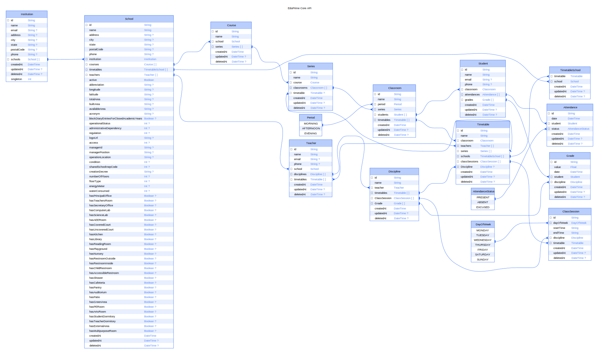

## Projeto EduPrime

Esse é o backend do EduPrime Plattform, eis o coração de integrações, sem ele não haverá luz.

Baseando-se em prisma, cada nova tabela, view ou similar, será um endpoint automaticamente.

## Diagrama ERD

Abaixo está o diagrama ERD via Prisma para o banco de dados:



# TODO LIST

## O que falta fazer?

- [x] Integrar JWT com PostgRest [Instruções](https://www.youtube.com/watch?v=ALeP-LtbLcA)
- [x] Integrar Prisma
- [] Criar usuários no banco via Prisma
- [] Criar usuários no Zitadel?
- [] Criar projeto para o Tenant?

# Manipulando o banco de dados

```
pnpm prisma generate
pnpm prisma migrate dev
pnpm run seed
```
